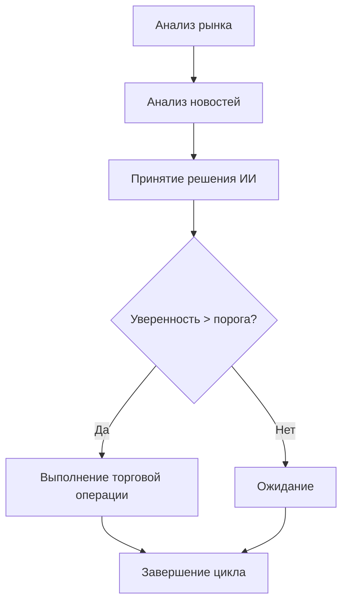

# Торговый робот с ИИ-агентом для биткойна

Автоматизированный торговый робот на основе LangGraph, LangChain, Ollama и Gemma3 для торговли биткойном на Bybit.

## 🚀 Возможности

- **ИИ-анализ рынка**: Использует Gemma3 для анализа технических индикаторов и принятия торговых решений
- **Многофакторный анализ**: Анализирует исторические данные, новостной фон и технические индикаторы
- **Интеграция с Bybit**: Полная поддержка API Bybit для торговли
- **Управление рисками**: Встроенные механизмы ограничения рисков и размера позиций
- **Автоматический поиск новостей**: Использует DuckDuckGo для анализа новостного фона
- **Исторические данные**: Интеграция с Alpha Vantage для анализа исторических цен
- **Подробное логирование**: Детальные логи всех операций и решений

## 📋 Требования

- Python 3.8+
- Ollama с моделью Gemma3
- API ключи для Bybit и Alpha Vantage
- Минимум 4GB RAM для работы с моделью

## 🛠 Установка

### 1. Клонирование и установка зависимостей

```bash
# Клонируйте репозиторий
git clone <repository-url>
cd trading-robot

# Создайте виртуальное окружение
python -m venv venv
source venv/bin/activate  # Linux/Mac
# или
venv\\Scripts\\activate  # Windows

# Установите зависимости
pip install -r requirements.txt
```

### 2. Настройка Ollama с Gemma3

```bash
# Запустите скрипт настройки Ollama
python setup_ollama.py
```

Этот скрипт автоматически:
- Установит Ollama (если не установлен)
- Загрузит модель Gemma3
- Настроит конфигурацию

### 3. Настройка API ключей

Скопируйте файл `.env.example` в `.env` и заполните необходимые данные:

```bash
cp .env.example .env
```

Отредактируйте `.env`:

```env
# Bybit API credentials
BYBIT_API_KEY=your_api_key_here
BYBIT_SECRET_KEY=your_secret_key_here
BYBIT_TESTNET=true  # Используйте true для тестирования

# Alpha Vantage API для исторических данных
ALPHA_VANTAGE_API_KEY=your_alpha_vantage_key_here

# Параметры торговли
TRADING_PAIR=BTCUSDT
POSITION_SIZE=0.001
MAX_POSITION_SIZE=0.01
STOP_LOSS_PERCENT=2.0
TAKE_PROFIT_PERCENT=3.0

# Управление рисками
MAX_DAILY_TRADES=5
MIN_CONFIDENCE_THRESHOLD=0.7

# Логирование
LOG_LEVEL=INFO
```

### 4. Получение API ключей

#### Bybit API
1. Зарегистрируйтесь на [Bybit](https://www.bybit.com/)
2. Перейдите в раздел API Management
3. Создайте новый API ключ с правами на торговлю
4. Скопируйте API Key и Secret Key

#### Alpha Vantage API
1. Зарегистрируйтесь на [Alpha Vantage](https://www.alphavantage.co/support/#api-key)
2. Получите бесплатный API ключ
3. Вставьте ключ в файл `.env`

## 🚀 Использование

### Запуск одного торгового цикла

```bash
python main.py --mode single
```

### Запуск непрерывной торговли

```bash
# Торговля каждые 30 минут
python main.py --mode continuous --interval 30

# Торговля каждые 15 минут
python main.py --mode continuous --interval 15
```

### Параметры командной строки

- `--mode`: Режим работы (`single` или `continuous`)
- `--interval`: Интервал между циклами в минутах (только для continuous)

## 📊 Архитектура системы

### Основные компоненты

1. **TradingAgent** (`trading_agent.py`) - Основной ИИ-агент на LangGraph
2. **BybitClient** (`bybit_client.py`) - Клиент для работы с Bybit API
3. **MarketAnalyzer** (`market_analyzer.py`) - Анализатор рынка с техническими индикаторами
4. **NewsAnalyzer** (`news_analyzer.py`) - Анализатор новостей через DuckDuckGo
5. **ErrorHandler** (`error_handler.py`) - Система обработки ошибок и логирования

### Workflow торгового агента



## 🔧 Конфигурация

### Параметры торговли

| Параметр | Описание | По умолчанию |
|----------|----------|--------------|
| `TRADING_PAIR` | Торговая пара | BTCUSDT |
| `POSITION_SIZE` | Размер позиции в BTC | 0.001 |
| `MAX_POSITION_SIZE` | Максимальный размер позиции | 0.01 |
| `STOP_LOSS_PERCENT` | Стоп-лосс в процентах | 2.0 |
| `TAKE_PROFIT_PERCENT` | Тейк-профит в процентах | 3.0 |
| `MAX_DAILY_TRADES` | Максимум торгов в день | 5 |
| `MIN_CONFIDENCE_THRESHOLD` | Минимальная уверенность для торговли | 0.7 |

### Технические индикаторы

Робот анализирует следующие индикаторы:
- **RSI** (Relative Strength Index)
- **MACD** (Moving Average Convergence Divergence)
- **Bollinger Bands**
- **SMA** (Simple Moving Average) - 20, 50, 200
- **EMA** (Exponential Moving Average) - 12, 26
- **Stochastic Oscillator**
- **Williams %R**
- **ATR** (Average True Range)

## 📈 Мониторинг и логи

### Логи

Все логи сохраняются в директории `logs/`:
- `trading_robot_YYYY-MM-DD.log` - Общие логи
- `trades_YYYY-MM-DD.log` - Торговые операции
- `errors_YYYY-MM-DD.log` - Ошибки

### Мониторинг

Робот выводит подробную информацию о:
- Текущей цене биткойна
- Анализе тренда и технических индикаторах
- Новостном фоне и тональности
- Принятых торговых решениях
- Выполненных операциях

## ⚠️ Управление рисками

### Встроенные механизмы защиты

1. **Лимиты торговли**: Максимальное количество операций в день
2. **Управление размером позиции**: Автоматический расчет на основе баланса
3. **Порог уверенности**: Торговля только при высокой уверенности ИИ
4. **Стоп-лосс и тейк-профит**: Автоматические уровни закрытия позиций
5. **Обработка ошибок**: Автоматическое восстановление после сбоев

### Рекомендации

- **Начните с тестового режима** (`BYBIT_TESTNET=true`)
- **Используйте небольшие суммы** для начального тестирования
- **Мониторьте логи** для понимания работы робота
- **Регулярно проверяйте баланс** и открытые позиции
- **Настройте уведомления** о критических событиях

## 🐛 Устранение неполадок

### Частые проблемы

1. **Ошибка подключения к Ollama**
   ```bash
   # Проверьте, запущен ли Ollama
   ollama list
   
   # Перезапустите Ollama
   ollama serve
   ```

2. **Ошибки API Bybit**
   - Проверьте правильность API ключей
   - Убедитесь, что у ключа есть права на торговлю
   - Проверьте, не превышены ли лимиты API

3. **Ошибки Alpha Vantage**
   - Проверьте правильность API ключа
   - Убедитесь, что не превышен лимит запросов (5 в минуту для бесплатного плана)

4. **Проблемы с моделью Gemma**
   ```bash
   # Перезагрузите модель
   ollama pull gemma2:9b
   ```

### Логи для диагностики

Проверьте логи в директории `logs/` для детальной информации об ошибках.

## 📚 Дополнительные ресурсы

- [Документация Bybit API](https://bybit-exchange.github.io/docs/)
- [Документация Alpha Vantage](https://www.alphavantage.co/documentation/)
- [Документация Ollama](https://ollama.ai/docs)
- [LangGraph документация](https://langchain-ai.github.io/langgraph/)

## ⚖️ Отказ от ответственности

Этот торговый робот предназначен для образовательных целей. Торговля криптовалютами связана с высокими рисками. Авторы не несут ответственности за возможные финансовые потери. Используйте на свой страх и риск.

## 📄 Лицензия

MIT License - см. файл LICENSE для деталей.

## 🤝 Поддержка

При возникновении проблем:
1. Проверьте логи в директории `logs/`
2. Убедитесь, что все зависимости установлены
3. Проверьте правильность конфигурации
4. Создайте issue в репозитории с подробным описанием проблемы