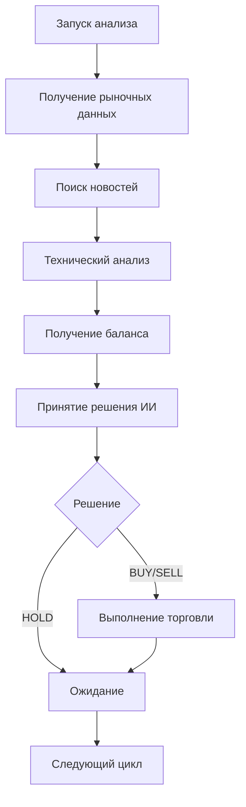

# 🤖 Торговый робот с ИИ-агентом

Автоматизированный торговый робот для торговли Bitcoin на Bybit с использованием ИИ-агента на основе LangGraph, LangChain, Ollama и модели Gemma3.

## 🚀 Возможности

- **ИИ-анализ рынка**: Использует Ollama с моделью Gemma3 для анализа рыночной ситуации
- **Технический анализ**: RSI, MACD, скользящие средние, полосы Боллинджера
- **Анализ новостей**: Автоматический поиск и анализ новостей через DuckDuckGo
- **Умное принятие решений**: LangGraph агент принимает торговые решения на основе комплексного анализа
- **Безопасная торговля**: Встроенные механизмы управления рисками
- **Надежность**: Обработка ошибок, повторные попытки, подробное логирование

## 📋 Требования

- Python 3.8+
- Ollama с моделью Gemma3
- API ключи Bybit
- Интернет-соединение

## 🛠 Установка

### 1. Клонирование и установка зависимостей

```bash
# Установка зависимостей
pip install -r requirements.txt
```

### 2. Установка Ollama и модели Gemma3

```bash
# Установка Ollama (Linux/macOS)
curl -fsSL https://ollama.ai/install.sh | sh

# Запуск Ollama
ollama serve

# В новом терминале загружаем модель Gemma3
ollama pull gemma2:9b
```

### 3. Настройка Bybit API

1. Зарегистрируйтесь на [Bybit](https://www.bybit.com/)
2. Перейдите в раздел API Management
3. Создайте новый API ключ с правами на торговлю
4. Скопируйте `.env.example` в `.env` и заполните данные:

```bash
cp .env.example .env
```

Отредактируйте `.env`:
```env
# Bybit API Configuration
BYBIT_API_KEY=your_bybit_api_key_here
BYBIT_SECRET_KEY=your_bybit_secret_key_here
BYBIT_TESTNET=true

# Ollama Configuration
OLLAMA_BASE_URL=http://localhost:11434
OLLAMA_MODEL=gemma2:9b

# Trading Configuration
TRADING_SYMBOL=BTCUSDT
TRADE_AMOUNT=0.001
MAX_POSITION_SIZE=0.01
RISK_PERCENTAGE=2.0

# Logging
LOG_LEVEL=INFO
```

## 🚀 Запуск

### Основной запуск

```bash
python main.py
```

### Режимы работы

1. **Одноразовый анализ** - выполнит анализ и примет решение один раз
2. **Непрерывный режим (каждый час)** - анализ каждый час
3. **Непрерывный режим (каждые 30 минут)** - анализ каждые 30 минут
4. **Непрерывный режим (каждые 15 минут)** - анализ каждые 15 минут
5. **Показать статус** - текущий статус робота

## 📊 Архитектура

### Компоненты системы

1. **TradingAgent** - основной ИИ-агент на LangGraph
2. **MarketDataTool** - получение рыночных данных
3. **NewsSearchTool** - поиск новостей через DuckDuckGo
4. **TechnicalAnalysisTool** - технический анализ
5. **BybitClient** - клиент для работы с Bybit API
6. **ErrorHandler** - обработка ошибок и логирование

### Поток работы



## ⚙️ Конфигурация

### Основные параметры

- `TRADING_SYMBOL` - торговая пара (по умолчанию BTCUSDT)
- `TRADE_AMOUNT` - размер торговли по умолчанию
- `MAX_POSITION_SIZE` - максимальный размер позиции
- `RISK_PERCENTAGE` - процент риска от баланса

### Безопасность

- Всегда начинайте с `BYBIT_TESTNET=true` для тестирования
- Установите разумные лимиты риска
- Регулярно проверяйте логи

## 📈 Технические индикаторы

Робот использует следующие индикаторы:

- **RSI (Relative Strength Index)** - индикатор перекупленности/перепроданности
- **MACD** - сходимость/расхождение скользящих средних
- **SMA (Simple Moving Average)** - простые скользящие средние (20, 50)
- **Bollinger Bands** - полосы Боллинджера
- **Volume Analysis** - анализ объемов торгов

## 🔍 Анализ новостей

Робот автоматически ищет новости по запросам:
- "Bitcoin BTC cryptocurrency news"
- Анализирует последние 3 дня
- Учитывает настроения рынка

## 📝 Логирование

Все действия записываются в файл `trading_bot.log`:

```
2024-01-15 10:30:15 - INFO - Анализ рыночных данных...
2024-01-15 10:30:16 - INFO - Текущая цена BTC: 45000.00
2024-01-15 10:30:17 - INFO - Поиск новостей...
2024-01-15 10:30:20 - INFO - Технический анализ...
2024-01-15 10:30:22 - INFO - Решение принято: BUY
```

## 🛡 Безопасность и риски

### ⚠️ Важные предупреждения

1. **Это экспериментальное ПО** - используйте на свой страх и риск
2. **Начните с тестнета** - всегда тестируйте на тестовой сети
3. **Ограничьте риски** - установите разумные лимиты
4. **Мониторьте работу** - регулярно проверяйте логи и результаты
5. **Не инвестируйте больше, чем можете потерять**

### Рекомендации

- Начните с минимальных сумм
- Используйте тестовую сеть Bybit
- Регулярно проверяйте логи
- Настройте уведомления о критических ошибках

## 🔧 Устранение неполадок

### Частые проблемы

1. **Ошибка подключения к Ollama**
   ```bash
   # Проверьте, что Ollama запущен
   ollama serve
   
   # Проверьте доступность модели
   ollama list
   ```

2. **Ошибка API Bybit**
   - Проверьте правильность API ключей
   - Убедитесь, что ключи имеют права на торговлю
   - Проверьте, что используете правильную сеть (testnet/mainnet)

3. **Ошибки получения данных**
   - Проверьте интернет-соединение
   - Убедитесь, что биржа доступна

### Логи и отладка

```bash
# Просмотр логов в реальном времени
tail -f trading_bot.log

# Поиск ошибок
grep "ERROR" trading_bot.log

# Анализ торговых решений
grep "Решение принято" trading_bot.log
```

## 📚 Дополнительные ресурсы

- [Bybit API Documentation](https://bybit-exchange.github.io/docs/)
- [Ollama Documentation](https://ollama.ai/docs)
- [LangGraph Documentation](https://langchain-ai.github.io/langgraph/)
- [CCXT Documentation](https://ccxt.readthedocs.io/)

## 🤝 Поддержка

При возникновении проблем:

1. Проверьте логи в `trading_bot.log`
2. Убедитесь, что все зависимости установлены
3. Проверьте конфигурацию в `.env`
4. Создайте issue с подробным описанием проблемы

## 📄 Лицензия

Этот проект предназначен для образовательных целей. Используйте на свой страх и риск.

---

**⚠️ Дисклеймер**: Торговля криптовалютами связана с высокими рисками. Автор не несет ответственности за возможные потери. Всегда тестируйте на тестовой сети перед использованием реальных средств.